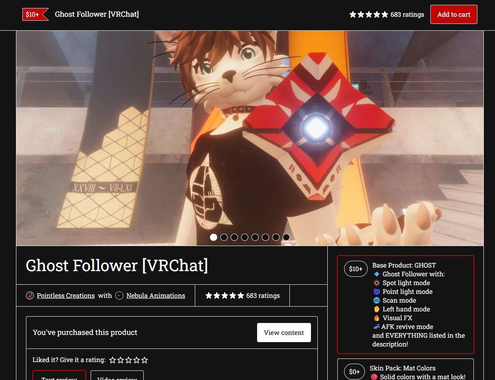
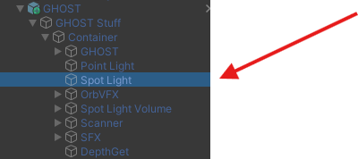
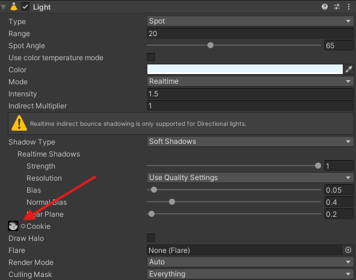
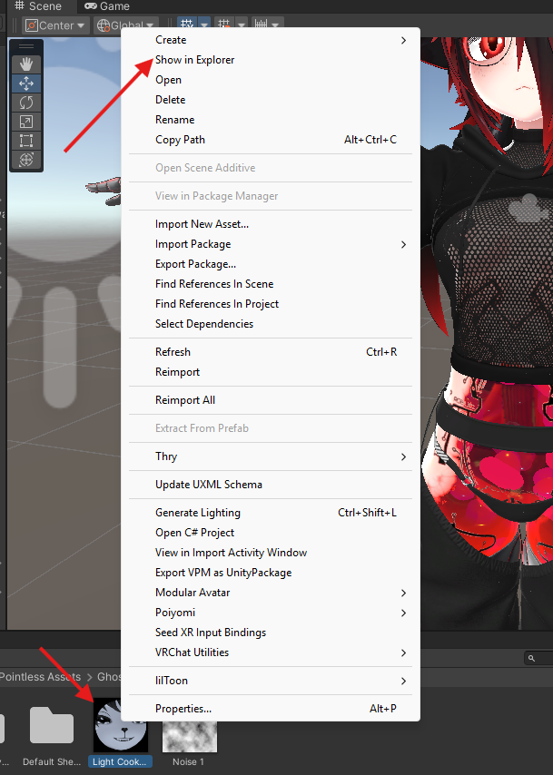

# ZRock Lamp

my text here

## Add to your avatar:

### 1. Download 

Download the Ghost Follower from the official store and follow the installation guide.

https://pointlesscreations.gumroad.com/l/Ghost?layout=profile

### 2. Download the Edit

### 3. Installation

Click on the prefab and go down to Spot Light

In Inspector click on "Cookie"

Now just right click the material, click on show in explorer and replace it with the edited picture you downloaded before.

 

If done correctly you should now have this ZRock Lamp and a cool Ghost Follower.

Put image here

