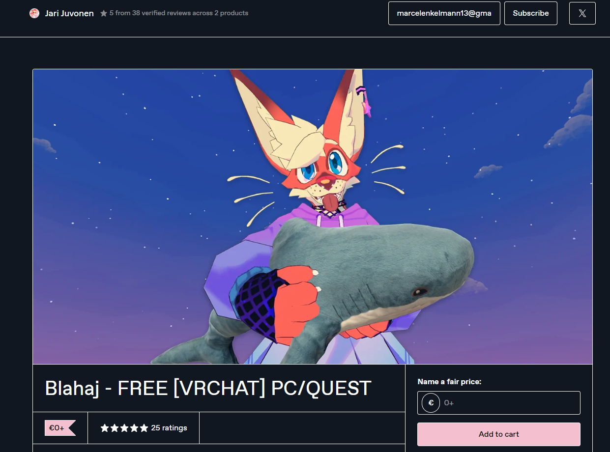
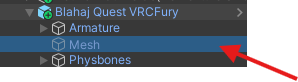
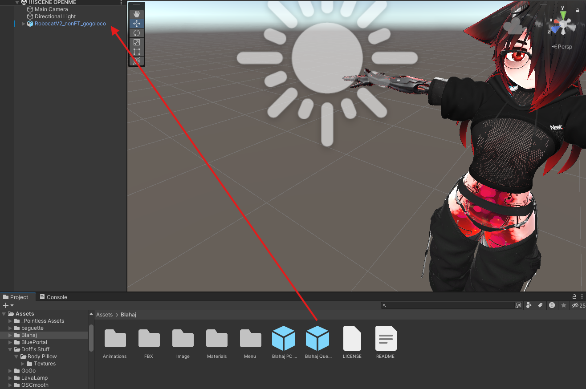
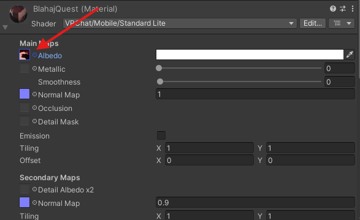
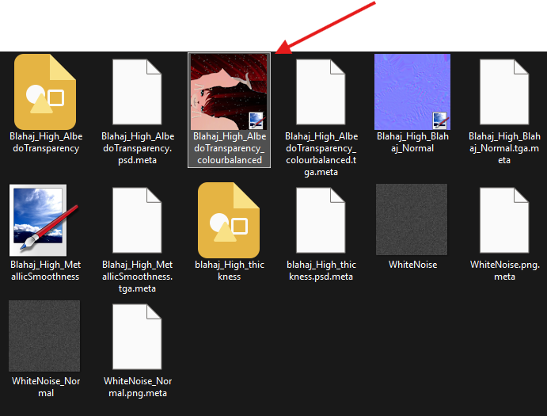
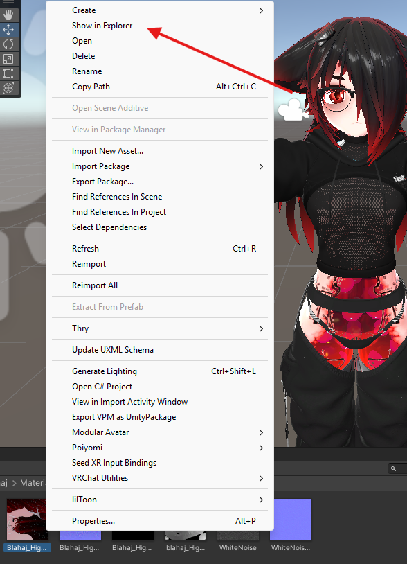
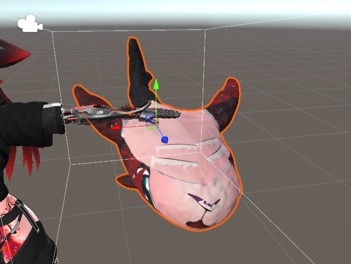

# Zrock Yoga Mat

my text here

## Add to your avatar:

### 1. Download 

Download the Blahaj from the official store and follow the installation guide.

https://rubixcreates.gumroad.com/l/YogaMat?layout=profile&recommended_by=library

### 2. Download the Edit

### 3. Installation

Open the assets folder and drag the Blahaj Quest Prefab into your Avatar Root.

Click on the prefab and go down to the mesh and go to the Inspektor on the right and click on shader

 

From there click on the material.

Now just right click the material, click on show in explorer and replace it with the edited picture you downloaded before.

 

If done correctly you should now have this Zlahaj.

