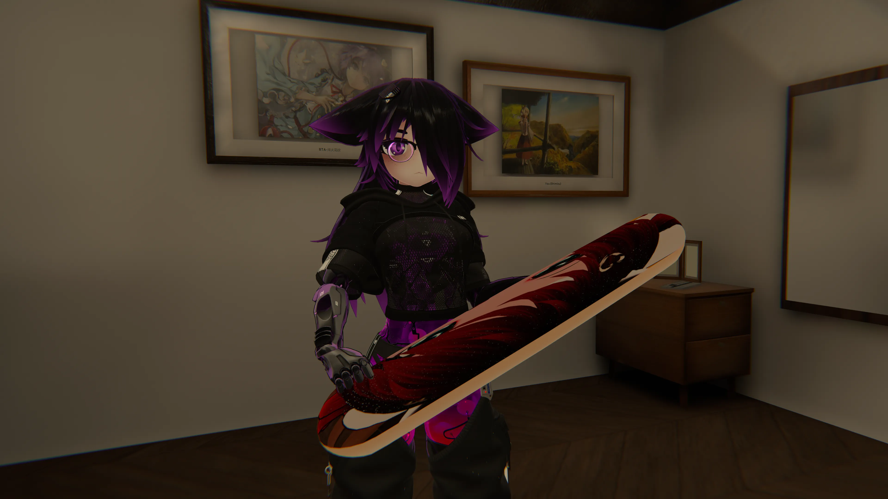
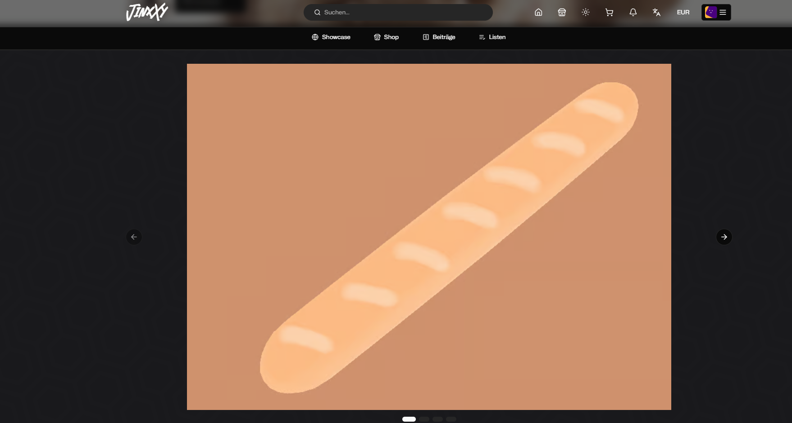
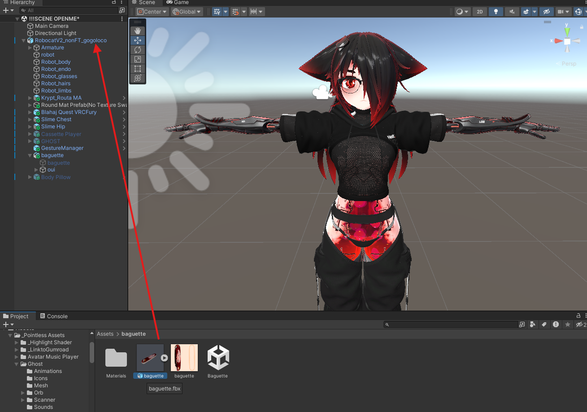
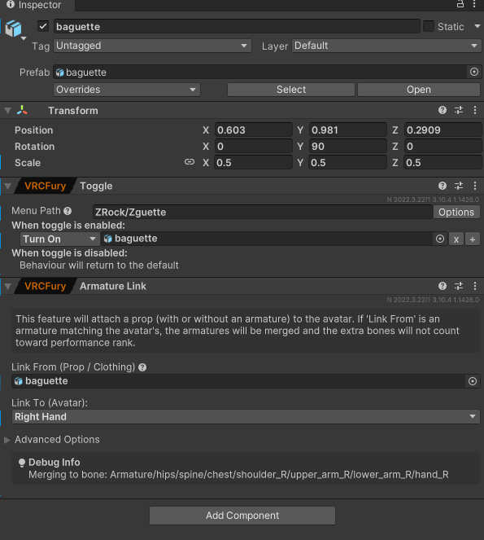
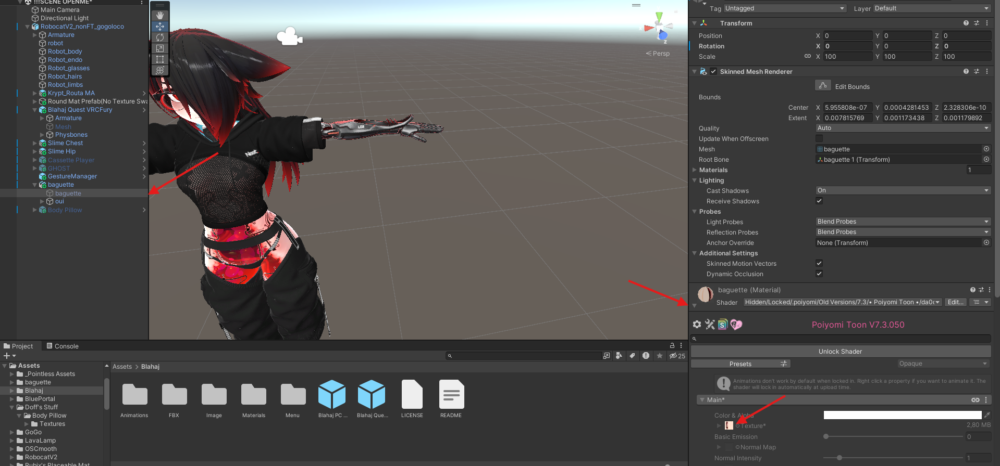
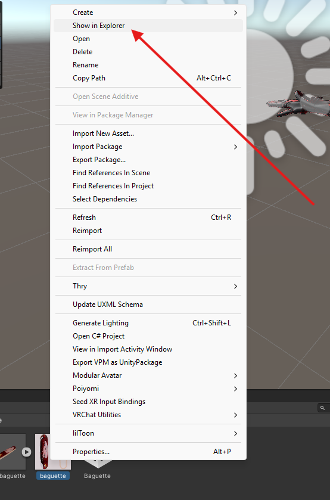
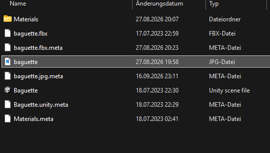
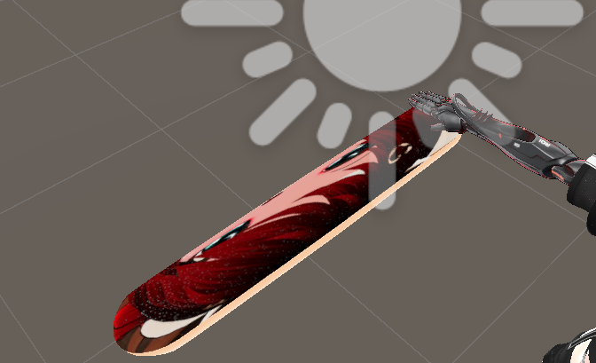

# Zguette

## Add to your avatar:

### 1. Download 

Download the Baguette from the official store and follow the installation guide.

[https://de.jinxxy.com/Smoresvr/WZyCq](https://de.jinxxy.com/Smoresvr/WZyCq)

### 2. Download the Edit

### 3. Installation

Open the assets folder and drag the Baguette Prefab into your Avatar Root.

Click on the prefab and apply all the changes shown in the image, make sure the prefab is hold by your right hand

 

From here click on baguette and go down to (the other baguette...), click on shader and click on the material.

Now just right click the material, click on show in explorer and replace it with the edited picture you downloaded before.

 

If done correctly you should now have a Zguette.

