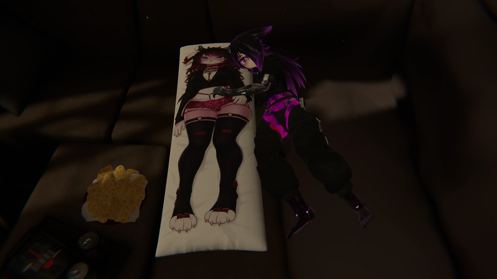
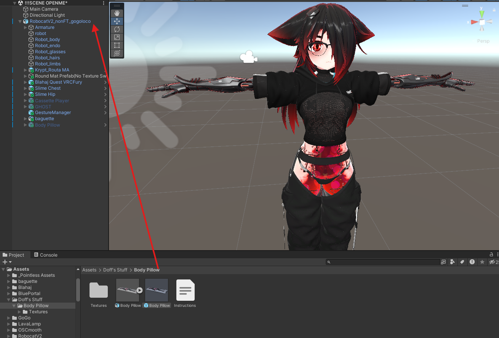
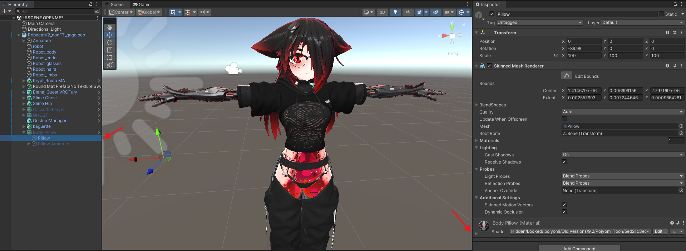
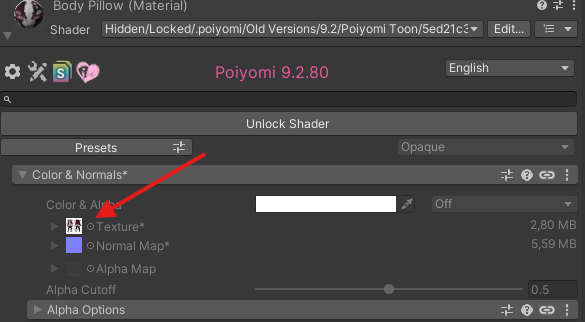
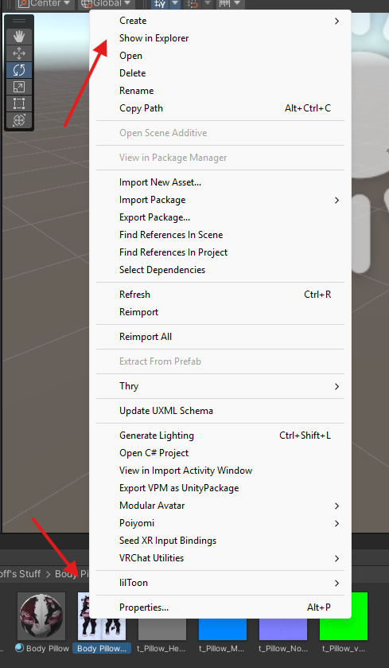
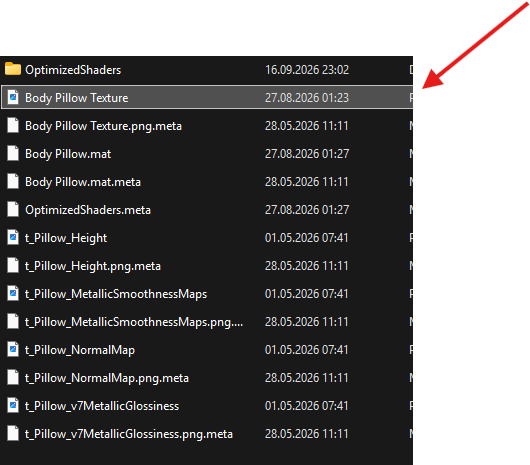
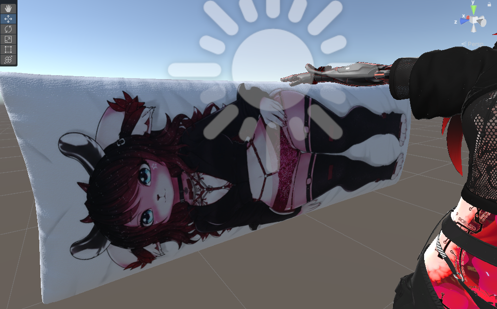

# Zrock Body Pillow

## Add to your avatar:

### 1. Download 

Download the Body Pillow from the official store and follow the installation guide.

[https://de.jinxxy.com/DingleDangleDof/iJ1Bk](https://de.jinxxy.com/DingleDangleDof/iJ1Bk)

### 2. Download the Edit

### DISCLAIMER the v1 Body Pillow Image is AI Generated (I cannot draw)
### the v2 Body Pillow Image (default download now) is **NOT** AI Generated.

### 3. Installation

Open the assets folder and drag the Body Pillow Prefab into your Avatar Root.

Click on the prefab and go down to Pillow, click on the Shader Arrow. 

From there click on the material.

Now just right click the material, click on show in explorer and replace it with the edited picture you downloaded before.

 

If done correctly you should now have a ZRock Body Pillow.

PS make sure to disable the prefab before uploading it

