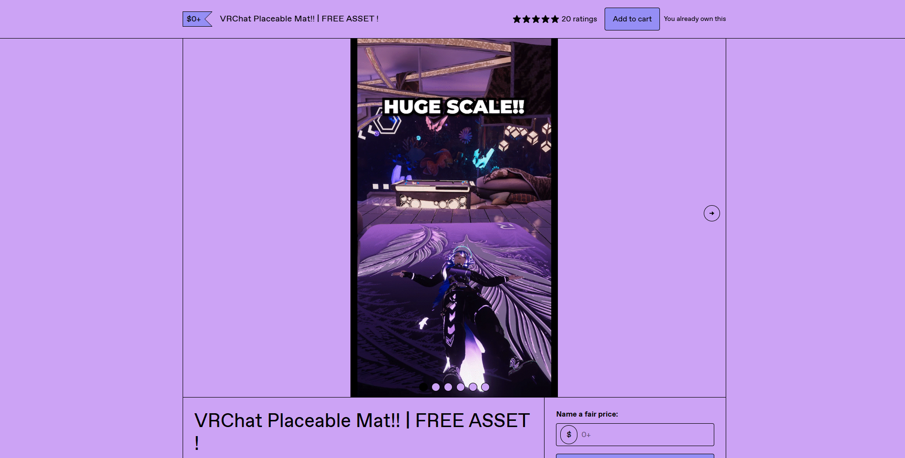
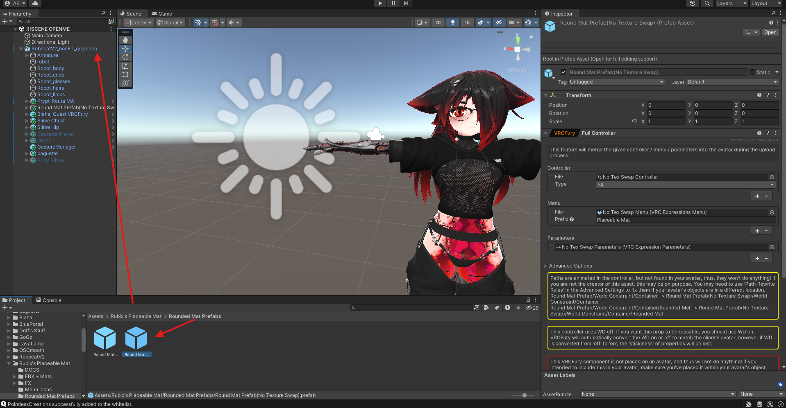
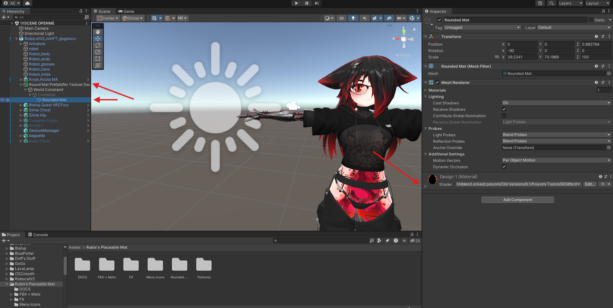
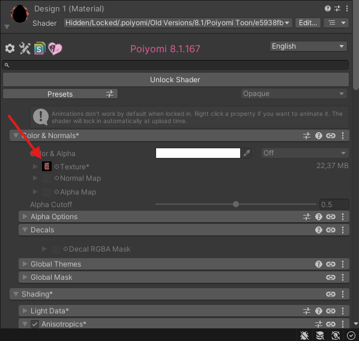
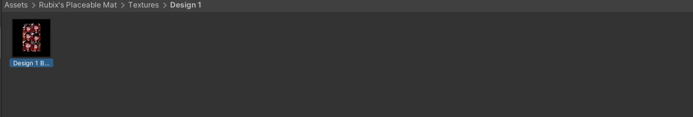
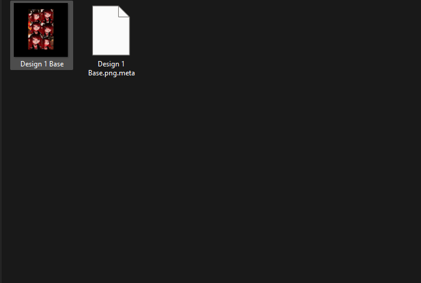
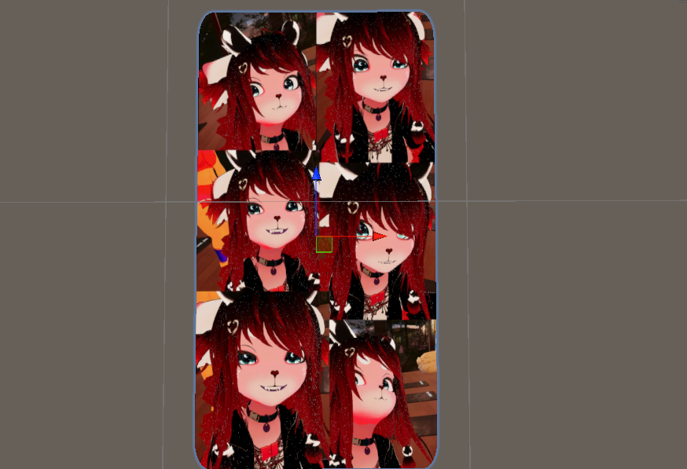

# Zrock Yoga Mat

## Add to your avatar:

### 1. Download 

Download the yoga mat from the official store and follow the installation guide.

[https://rubixcreates.gumroad.com/l/YogaMat?layout=profile&recommended_by=library](https://rubixcreates.gumroad.com/l/YogaMat?layout=profile&recommended_by=library)

### 2. Download the Edit

### 3. Installation

Open the assets folder and drag the No Texture Swap Prefab into your Avatar Root.

Click on the prefab and go down to Rounded Mat, click on the Shader Arrow. 

From there click on the material.

Now just right click the material, click on show in explorer and replace it with the edited picture you downloaded before.

Make sure its in the Design 1 folder.

If done correctly you should now have this Yoga Mat.

